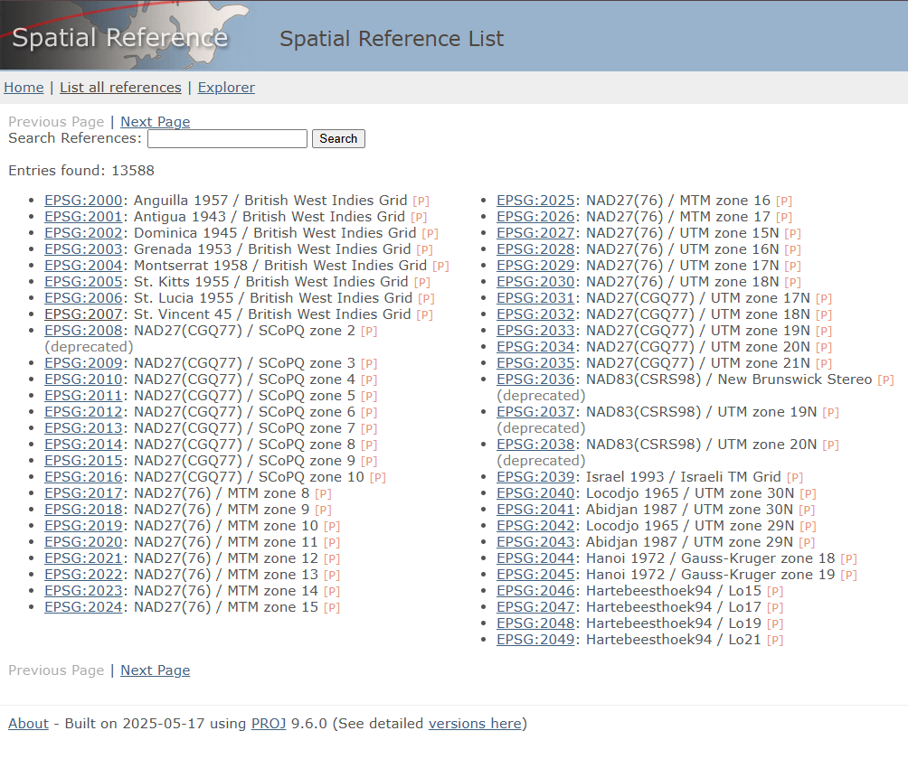
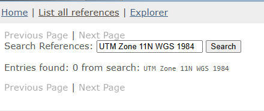
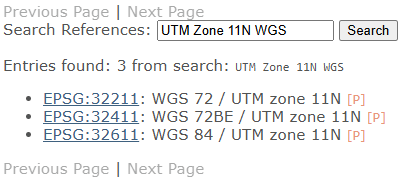
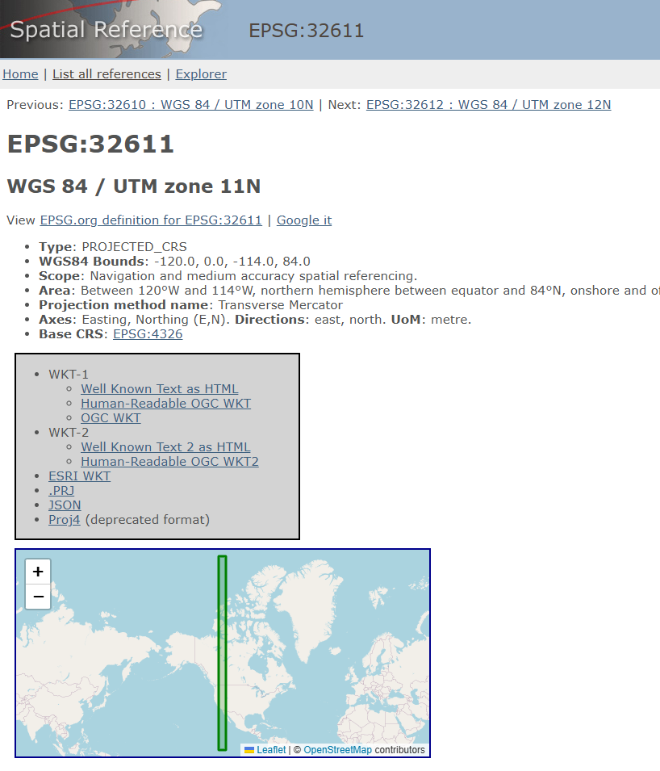
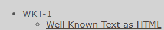
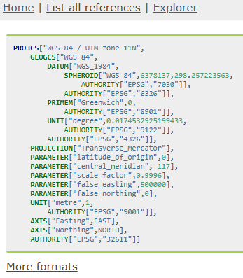

# Georeferencer

## Reference System Information
A reference system (more commonly known as a **spatial reference system (SRS)** or **coordinate reference system (CRS)**) defines how the pixel coordinates of your raster image are translated into real-world coordinates.

Reference systems can be represented in several forms. Common representations include:
### 1. WKT Strings

Example:

```wkt
GEOGCRS["WGS 84",
    DATUM["World Geodetic System 1984",
        ELLIPSOID["WGS 84",6378137,298.257223563,
            LENGTHUNIT["metre",1]]],
    PRIMEM["Greenwich",0,
        ANGLEUNIT["degree",0.0174532925199433]],
    CS[ellipsoidal,2],
        AXIS["latitude",north],
        AXIS["longitude",east],
    ID["EPSG",4326]]
```

### 2. PROJJSON Schemas

```json
{
  "type": "GeographicCRS",
  "name": "WGS 84",
  "datum": {
    "type": "GeodeticReferenceFrame",
    "name": "World Geodetic System 1984",
    "ellipsoid": {
      "name": "WGS 84",
      "semi_major_axis": 6378137,
      "inverse_flattening": 298.257223563
    }
  },
  "coordinate_system": {
    "subtype": "ellipsoidal",
    "axes": [
      { "name": "Latitude", "direction": "north", "unit": "degree" },
      { "name": "Longitude", "direction": "east", "unit": "degree" }
    ]
  }
}
```
### Authority Identifiers
Ex: EPSG:4326


We will go in a bit more depth on Authority Identifiers as they are a bit more obscure. 

An authority identifier consists of an authority name and an authority code. An authority name specifies the organization that maintains a catalog of 
coordinate reference systems. An authority code is used to access a specific spatial reference system in that organization. Together, you are
able to easily access the parameters that describe a coordinate reference system without having to specify the full WKT string or full PROJJSON schema.

The Georeferencer tool in WISER allows you to specify a coordinate reference system by the authority name and authority code. If you do not know your
authority name or authority code but you do have the WKT string or PROJJSON schema, then you will likely be able to find your authority name and code combo.

Lets go through the below example to guide you through this process. 

Lets say I have this WKT string (found in my .hdr file):
```
coordinate system string = {PROJCS["UTM_Zone_11N",GEOGCS["GCS_WGS_1984",DATUM["D_WGS_1984",SPHEROID["WGS_1984",6378137.0,298.257223563]],PRIMEM["Greenwich",0.0],UNIT["Degree",0.0174532925199433]],PROJECTION["Transverse_Mercator"],PARAMETER["False_Easting",500000.0],PARAMETER["False_Northing",0.0],PARAMETER["Central_Meridian",-117.0],PARAMETER["Scale_Factor",0.9996],PARAMETER["Latitude_Of_Origin",0.0],UNIT["Meter",1.0]]}
```

I see that it has UTM Zone 11N and WGS 1984 which are used to describe this reference system. I'll take just combine this to be 'UTM Zone 11N WGS 1984'

I'll then go to this website https://spatialreference.org/ref/ 


and enter in 'UTM Zone 11N WGS 1984'



Uh oh. It didn't find it. Maybe that's because I did too specific of a search. Let's try 'UTM Zone 11N WGS'


And viola, I found some authority name and code combinations. I can check to make sure these match my WKT string by clicking on them
which will navigate me to a page like this:

And clicking on WKT-1 as HTML

Then I can compare the WKT string found at the URL to mine to ensure they are the same. 

