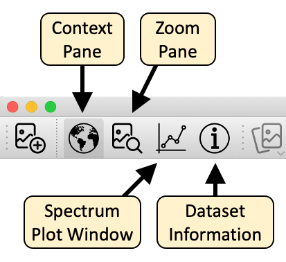

Welcome to WISER, the Workbench for Imaging Spectroscopy Exploration and
Research.  WISER makes it easy to load and analyze spectral imaging data sets
with a variety of helpful features.

**IMPORTANT NOTE:  WISER is currently in alpha, which means that this
documentation may be incomplete and/or out of date.**  Feel free to email
[wiser@caltech.edu](mailto:wiser@caltech.edu) if you have any questions or
comments.

**NOTE:**  WISER can also be extended with custom functionality through its
[plugin API](https://ehlmann-research-group.github.io/WISER-Plugin-API/).

# Overview

The goal of WISER is to provide an intuitive and configurable user interface
that supports many different workflows and styles of interaction.  When WISER
is started, the UI looks like this:

The WISER interface provides multiple panes for displaying raster data at
varying levels of magnification.  The Context Pane starts out on the left side
of the UI, and shows the raster data "scaled out," so that either one or both
dimensions are fully visible within the pane.  The primary viewing area is
called the Main Window, providing more detailed interactions with raster data,
possibly scaled up to as much as 1600%.  In the above screenshot, no raster
data is loaded yet, so these areas display "(no data)".

Across the top of the Main Window is the Main Toolbar, which provides various
tools to work with raster data:

The buttons marked "Display Toggles" will show and hide specific tools for
interacting with spectral data.  These buttons are as follows:

These tools are described in subsequent sections.

## WISER Configuration

WISER provides a configuration panel for specifying common configuration across
the various tools.  You can access these properties through the WISER menubar.
For example, on macOS you can access "WISER" -> "Preferences" to show this
dialog:

These settings are saved on disk so that they don't need to be specified every
time.  Some additional details are given in the following sections.

### WISER Crash and Error Reporting

WISER is capable of sending crash reports to an online service called
[BugSnag](https://www.bugsnag.com).  This option is **off** by default, but
it is very helpful if you turn this feature on so that application errors and
crashes can be identified and addressed automatically.  No personally
identifying information is sent to BugSnag, but some users may still not want
to leave such a feature on.

### Wavelengths for Red/Green/Blue Colors

For spectral data sets that include visible-light frequencies, WISER is able to
automatically choose "true-color" bands that are close to the frequencies of
red, green and blue light.  However, different data sets and instruments may
require tweaking of what is considered "red", "green" or "blue".  Thus, WISER
allows the user to configure these values.

# Viewing an Image

Here is a screenshot of WISER after loading AVIRIS data of the Caltech campus
and the surrounding Pasadena area.

In this image, all of the different tools have been shown using the display
toggle buttons in the main toolbar:  the context pane, the main window and the
zoom pane, as well as the spectral plot window and the dataset information
window.

All of these components are dockable, and can be moved or resized within the
WISER user interface.  They can also be undocked from the UI, so that they
appear as separate windows.  Arrange WISER's user interface however you like it
best!

As the snapshot indicates, the area visible in the zoom pane is indicated in the
main window.  Correspondingly, the area visible in the main window is indicated
in the context window.  _(Tip:  The color of this viewport highlight can be
changed in the WISER configuration dialog.)_  Mouse-clicks or scrolling within
the various display windows will update the other windows.

Mouse clicks within the main or zoom windows will also select the clicked-on
pixel, and update the spectrum plot window with the pixel's spectrum.

# Dataset Tools

The dataset toolbar buttons provide useful operations to switch between
datasets, change what bands are being displayed, and to adjust the contrast
stretch of the bands being displayed.  Note that all raster display windows
have one or more of these buttons, allowing for control of how raster data
is displayed.

## Dataset Chooser

The _dataset chooser_ simply allows the user to change what data set is being
displayed in a given pane.  When clicked, the dataset chooser will show a
pop-up menu listing all data sets currently loaded, and selecting a different
data set will switch the display to that data set.

## Band Chooser

The _band chooser_ shows a dialog that gives the user significant control over
what bands are being displayed, and whether the image is to be shown in RGB
mode (three bands) or grayscale mode (one band only).

When the grayscale or single band option is selected in the Band Chooser, WISER can display with a color bar or gradient.

Besides letting the user select any combination of bands, the band chooser also
exposes the ability to select the dataset's default bands, if any were
indicated in the original data file.  Finally, if the dataset specifies
wavelengths or frequencies for each band, and if these wavelengths are near the
red/green/blue frequencies specified in WISER's global configuration, the band
chooser can automatically choose the bands closest to these frequencies.

Note that if a data set does not have default display bands, or if the data
set doesn't have visible-light frequencies, the corresponding button in the
dialog will be disabled.

## Contrast Stretch

The contrast stretch tool provides sophisticated options for adjusting the
contrast of images being displayed.  This allows the user to bring out details
in the image data that might otherwise not be perceptible.

Here is an example of the contrast stretch tool being used with the Caltech
AVIRIS data.

A histogram is shown for each display band, allowing one to see the
distribution of values for that band.  The user can select both the kind of
contrast stretch used, and any conditioners to apply to the data before
applying the stretch.  Because it is useful to see the results of applying
contrast stretch, changes in the dialog are immediately reflected in the
affected raster displays.  If the "Cancel" button is pressed, the changes
will be discarded; otherwise, they will be kept when the dialog is closed.

Here is another example of applying a 2.5% linear stretch to the Caltech
AVIRIS data:

When applying a linear stretch, the sliders may be adjusted to control the
endpoints of the contrast-stretch operation.  Additionally, minimum and
maximum values may be specified, to exclude noise that appears outside the
range of useful data, or to focus in on a specific range of values.

For a detailed description of how WISER performs contrast stretch calculations,
please refer to [this document](./contrast-stretch.html).

# Grid View and Image Linking

WISER allows simultaneous viewing of multiple images in the main window through the grid view, and images of the same size can be linked. Any grid dimensions can be input. Click the grid icon to split or unsplit the main view.

Note that, once images are displayed in a grid, the band selector and contrast stretch options are available above each image and not in the main WISER toolbar.

Images in the grid can only be linked if all images open in WISER have the same spatial dimensions.

# Regions of Interest

WISER supports the creation of Regions of Interest (ROI) on a raster data set.
Regions of Interest may be created in both the main window and the zoom window.
Once a ROI has been created, the average spectrum over the ROI may be plotted,
and the spectra of all pixels in the ROI may be exported as an ASCII file.

Here are the Region of Interest tools in the main toolbar:

The first button allows a new Region of Interest to be created; a dialog allows
the user to enter basic details about the Region of Interest.  It is recommended
to use a different color for each Region of Interest to avoid confusion.

Once a Region of Interest is created, _selections_ may be added to the ROI.
The right button allows users to create rectangle, polygon, and point-set
selections, which will then be added to the current Region of Interest.  The
ROI that the selection is added to may be changed with the drop-down combobox
in the toolbar.

> Tip:  The status bar at the bottom of the UI provides instructions about how
> to create each kind of selection.

Here is the UI state after two Regions of Interest have been created - one named
"grass" and the other named "solar panels".  Note that the "solar panels" ROI
is comprised of multiple overlapping rectangle selections (this could also be
done with a single polygon selection).  **It is not a problem to have
overlapping selections in a Region of Interest;** each pixel in the ROI will
only be used once by operations on the ROI.

Once a Region of Interest has been created, right-clicking in the ROI's
selections will pop up a context menu providing various operations with the ROI.

*   The ROI's information or display color may be edited
*   Individual selections in the ROI may be edited or deleted, or the entire
    ROI may be deleted
*   The average spectrum of the ROI may be displayed in the spectrum plot
    window
*   The spectra of every pixel in the ROI may be exported as an ASCII file
*   Import and export ROI's as .geojson files

# Saving and Subsetting Datasets

There are two ways to save datasets with options for spatial and spectral subsetting. The first is by right clicking the image and selecting "Save as..." The second option is "Save dataset" in the file menu, selecting the image to export. 

In the dialog box, click "Show Advanced" to access the following:

*   Data description
*   Data ignore value
*   Spatial subsetting ("Dimensions" tab)
*   Choose the wavelengths to save and set bad bands
*   Set default RGB or grayscale display bands

# Spectral Plots
Spectra can be viewed from any image dataset with multiple bands by clicking points on the main and zoom windows. Choose the plot symbol on the main toolbar. X-axis units are wavelengths if available; otherwise, units are band numbers. Spectra can be "collected" and retained on screen or in a list, turned on and off, and their colors changed. Clicking on the plot displays the (x, y) coordinates of the point. Right click on the plot to hide the coordinates of the selected point.

When multiple images are displayed in grid view, the plot will display spectra from any dataset that the user clicks. Using the upper left icon on the plot, the user can opt to always pull spectra from one particular dataset. This is particularly useful with linked datasets in grid view such that clicking on one  image will display a spectrum from the same pixel in a linked image.

The import tool on the plot opens spectral libraries (.sli) and ASCII files with spectra. For ASCII files  WISER opens a dialog box to select the column delimiter and identify which column(s) specify wavelength values. 

By default, imported spectra are listed but not displayed. All spectra can be shown or hidden by right clicking the name of the file or library in the list below the plot, or individual spectra can be displayed by right clicking on the spectrum name.

The spectral plot has many configuration options:

*   Plot and axis titles
*   Fonts and sizes
*   x- and y-axis ranges
*   Major and minor tick mark intervals
*   Number of pixels to average for each selected point, with options for mean and median
*   Display legend

By right clicking on plots, WISER provides an option to "Export Plot to Image." Available formats are EPS, PDF, PNG, and SVG with 72, 100, or 300 dpi resolution. 

# Band Math

The band math utility is available in the Tools menu. WISER band math supports the following operations: arithmetic, power/root, and comparisons/conditionals. Expressions can be saved for future use, and band math can be extended with user-defined functions in plugins. Variables can be mapped to full images, single bands, and spectra. Help can be toggled to see the band math operators.

> Note: Band math is not currently optimized to operate on very large images and may exceed the memory availability of the user’s computer. The expected size of the output is calculated to help users assess whether band math operations are feasible given the image size and computing resources.
